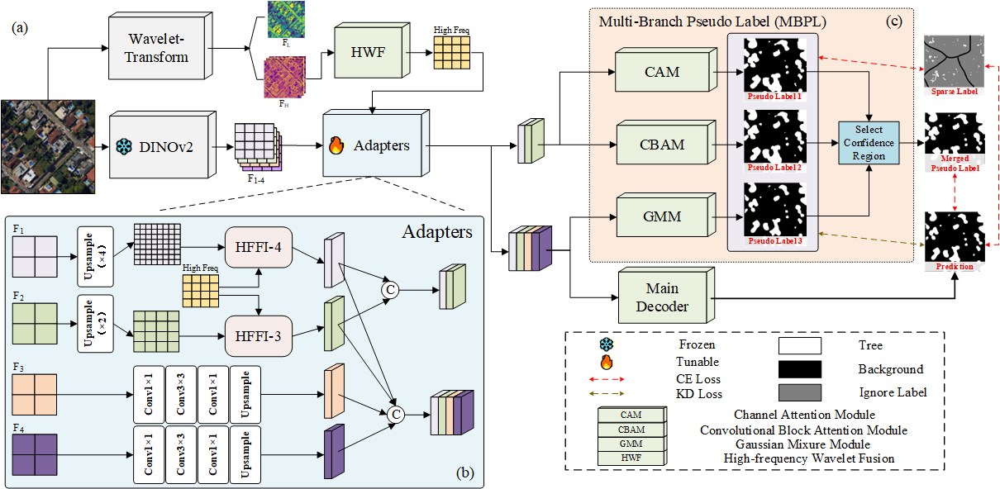
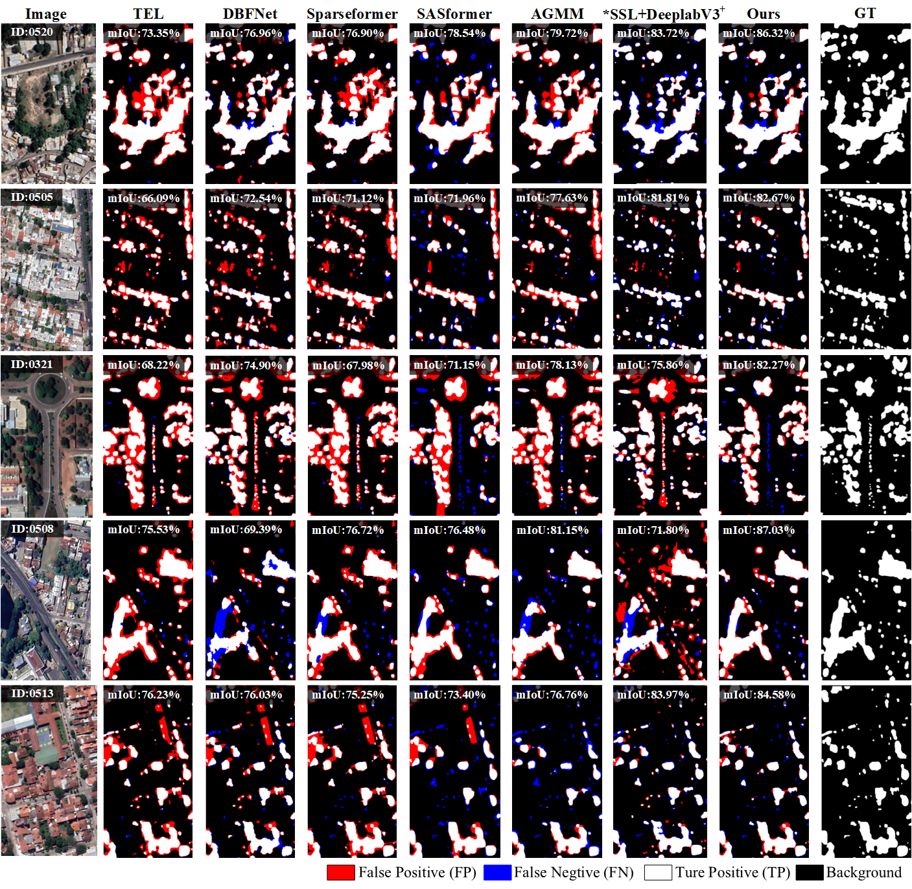

# AMP: Wavelet-enhanced Foundation Model Adaptation for Weakly Supervised Urban Tree Canopy Mapping

### **Accepted by IEEE Transactions on Geoscience and Remote Sensing (TGRS) 2026**

---

## 🌟 Method Overview
This repository contains the official PyTorch implementation of **AMP**, a framework designed for high-accuracy urban tree canopy mapping using weakly supervised sparse annotations. By integrating wavelet-enhanced adaptation with foundation models (DINOv2), our method effectively captures fine-grained spatial details in complex urban environments.


*Figure 1: The overall architecture of the proposed AMP framework.*

---
## 📷 Result Display

*Figure 2: Qualitative results of different methods on the test set of the UTC dataset. Methods marked with * indicate fully supervised approaches.*
---

## 🛠️ Installation & Training & Inference

### 1. Clone the repository
```bash
git clone https://github.com/Tengmingn/AMP.git
cd AMP
conda create -n amp python=3.10
conda activate amp
pip install -r requirement
```
### 2. Download the UTC-Sparse dataset
get our dataset at https://ieee-dataport.org/documents/utc-sparse
### 3. Prepard third party code
```
cd third_party
# dinov2
git clone https://github.com/facebookresearch/dinov2.git
# dinov3 if you want
git clone https://github.com/facebookresearch/dinov3.git
```
Then, insert the `user_forward_features` function into the respective model files. The corresponding function codes are provided in `./third_party/dinov2_userfunc` and `./third_party/dinov3_userfunc`.

Alternatively, you can download our pre-packaged third-party folder and extract it directly into the `./third_party` directory.
`https://pan.baidu.com/s/1Y_2E5OTQpKRoBlxD-HDMdw?pwd=57kr` password: 57kr
### 4. Reproduce
Our pre-trained and fine-tuned models are available at: `https://pan.baidu.com/s/1TzAoo50w1w1lWD5H_yIrHA?pwd=edhq` password: edhq
### 5. Training on your own dataset
### 6. Inference
## ❤️ Acknowledgement

We sincerely acknowledge the following works for their valuable contributions and inspiration to this project:

- **SparseFormer: A Credible Dual-CNN Expert-Guided Transformer for Remote Sensing Image Segmentation With Sparse Point Annotation (TGRS 2025)** — for providing the implementation of the multi-branch pseudo-label generation strategy.(https://github.com/Yujia73/SparseFormer)

- **Sparsely Annotated Semantic Segmentation with Adaptive Gaussian Mixtures** — for providing the foundational network structure implementation.(https://github.com/Luffy03/AGMM-SASS)

- **DINOv2: Learning Robust Visual Features without Supervision** — for providing the pretrained visual feature backbone used in this work.(https://github.com/facebookresearch/dinov2)

We deeply appreciate the authors of these works for making their research and code publicly available to the community.

## 🎓 Citations

## 📧 Contact
If you have any inquiries, please reach out us via email at `tmn@tju.edu.cn`

